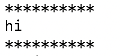

## Instructions for students:

### Pass Arguments

Create 2 files, index.js, and stars.js. Use index.js to require stars.js and to print the number `10` and the word `"hi"`.

stars.js should log stars `*` 10 times, on the next line the word from index.js and at the bottom starts `*` 10 times.

-   See Image for reference:
    

-   run this file with node index.js

### Rules

-   This is an individual assignment.
-   Deadline: 30 minutes.
-   Use **Git properly**
